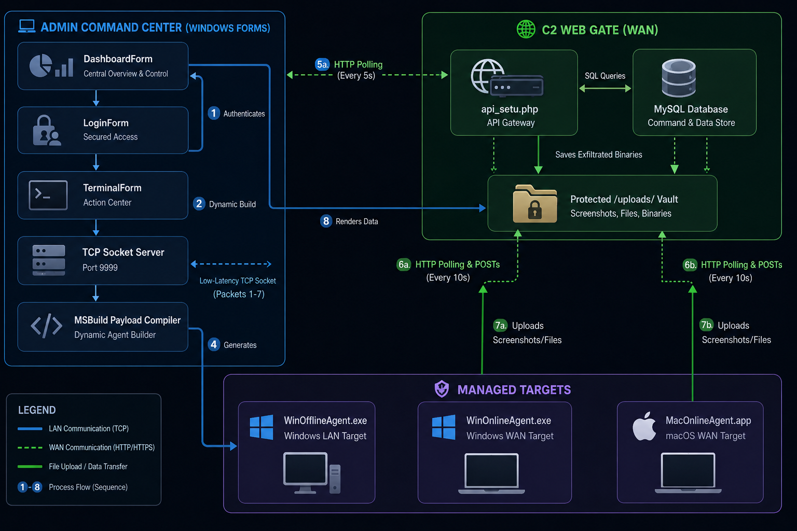

<p align="center">
  
</p>

# 🌌 ANTARYAMI-SETU (अन्तर्यामी सेतु)
### *Omniscient Bridge - High-Tech Remote Administration & C2 Command Suite*

---

## 📖 Executive Summary
**ANTARYAMI-SETU** (meaning *"Omniscient Bridge"* or *"Inner Controller Bridge"* in Sanskrit) is an advanced, high-tech Remote Administration Tool (RAT) and Command & Control (C2) ecosystem. Engineered for high-fidelity endpoint monitoring and operational orchestration, the suite supports dual-mode communication paradigms: direct low-latency **TCP sockets** (for Local Area Networks/LAN) and RESTful **HTTP/S polling** (for Wide Area Networks/WAN). 

* **Developer:** [Ragib Uddin (RK)](https://ragibuddin.in)
* **Detailed Documentation & Research:** [Read the full research paper here](https://ragibuddin.in/research/antaryami-setu)

The ecosystem provides native administrative control over both Windows and macOS target platforms. Featuring a premium, sci-fi cyber-hacker aesthetic (HUD styling, glassmorphism, animated radar circles, and real-time visualization graphs), the suite provides administrators with an immersive operational dashboard to control target environments, exfiltrate strategic intelligence, and capture live telemetry.

---

## 🏗️ Architecture & Components

The project consists of three main components:

### 1. Admin Dashboard (`/Admin`)
A robust C# WinForms application targeting .NET 10.0 that acts as the Command & Control (C2) center.
- Acts as a **TCP Server** on port 9999 to accept direct connections from Offline Agents.
- Acts as an **HTTP Client** to fetch data and send commands to Online Agents via the PHP API.
- Features a futuristic dark-themed UI with real-time traffic monitoring, Geo-IP node mapping, auto-lock security, and a payload builder.

### 2. Offline Agent (`/WinOfflineAgent`)
A standalone C# .NET 10.0 agent designed for local or direct-network administration.
- Connects directly to the Admin Dashboard via raw TCP sockets.
- Requires administrator privileges to run.
- Self-installs into `ProgramData` and registers for startup persistence via Windows Task Scheduler.
- Runs completely silently in the background (Windowless).

### 3. Online Agents (`/WinOnlineAgent` & `/MacOnlineAgent`) & PHP API
C# .NET 10.0 agents designed for over-the-internet administration where direct TCP connections are not feasible (e.g., behind NAT/Firewalls). 
Their sole responsibility is to run silently in the background, periodically pinging the central C2 server with telemetry so the administrator can see if the target device is online.
- Polls a central web server (`api_setu.php`) for commands using standard HTTP POST/GET requests.
- Avoids firewall blocks by blending in with regular web traffic.
- **Dynamic Token Security**: The API is strictly secured via a dynamic session token architecture. Agents register with a low-privilege key and generate unique Session Tokens (`X-API-KEY`) per execution.
- **IP-Based Rate Limiting**: Features a database-backed rate limiter set to 300 requests/minute to prevent DDoS.
- **PHP API (`api_setu.php`)**: Acts as the middleman database/relay between the Admin Dashboard and the Online Agent.

---

## 🎯 Functional Feature Matrix

| Feature | 📡 WinOffline Agent (TCP LAN) | 🌐 WinOnline Agent (HTTP WAN) | 🍎 MacOnline Agent (HTTP WAN) |
| :--- | :--- | :--- | :--- |
| **Target OS** | Windows 10 / Windows 11 | Windows 10 / Windows 11 | macOS (Intel & Apple Silicon) |
| **Connection Topology** | Direct TCP Sockets (Port 9999) | RESTful HTTP Polling (`api_setu.php`) | RESTful HTTP Polling (`api_setu.php`) |
| **Communication Latency** | Ultra Low Latency (<10ms) | Dynamic Polling Delay (3s - 5s) | Dynamic Polling Delay (5s fetch, 10s telemetry) |
| **Required Privileges** | **Administrator** | **Administrator** | User (LaunchAgent Context) |
| **Remote Screen Capture** | Live Streaming Viewport | Static JPEG screenshots | Static PNG screenshots |
| **File Explorer UI** | Interactive Tree/ListView | Command-line explorer | Command-line explorer |
| **Clipboard read/write** | Full STA Thread Sync | Not Supported | Not Supported |
| **Keystroke Monitoring** | Real-time Keyboard hook buffer | Delayed interval HTTP updates | Not Supported (Requires TCC) |
| **File Exfiltration** | Direct Socket Transfer | Server File Vault Upload | Server File Vault Upload |
| **System Info & Telemetry** | Automated 10-second TCP broadcast | Polling request registry updates | Polling request registry updates |
| **System commands (shell)**| Direct Cmd/PowerShell execution | Scheduled database job processing | Scheduled database job processing (zsh) |
| **Persistence Mechanism** | Windows Task Scheduler & Registry | Windows Task Scheduler & Registry | macOS Startup LaunchAgent (`.plist`) |
| **Stealth Mode** | Windowless background process | Windowless background process | Windowless background process (`LSUIElement`) |

---

## 📐 System Architecture

```mermaid
graph TD
    %% Admin Suite Node
    subgraph Admin_Suite ["💻 Admin Command Center (Windows Forms)"]
        Dash[DashboardForm]
        Login[LoginForm - Secured Access]
        Term[TerminalForm - Action Center]
        Server[TCP Socket Server - Port 9999]
        Compiler[MSBuild Payload Compiler]
    end

    %% Web Infrastructure
    subgraph Web_Infrastructure ["🌐 C2 Web Gate (WAN)"]
        API[api_setu.php]
        DB[(MySQL Database)]
        VaultDir[Protected /uploads/ Vault]
    end

    %% Target Agents
    subgraph Targets ["🔒 Managed Targets"]
        OffAgent[WinOfflineAgent.exe - Windows LAN Target]
        OnAgentWin[WinOnlineAgent.exe - Windows WAN Target]
        OnAgentMac[MacOnlineAgent.app - macOS WAN Target]
    end

    %% LAN Flows
    Login -->|1. Authenticates| Dash
    Dash -->|2. Dynamic Build| Compiler
    Compiler -->|4. Generates| OffAgent
    Server <-->|Low-Latency TCP Socket (Packets 1-7)| OffAgent

    %% WAN Flows (Windows)
    Dash <-->|5a. HTTP Polling (5s)| API
    OnAgentWin <-->|6a. HTTP Polling & POSTs (10s)| API
    OnAgentWin -->|7a. Uploads Screenshots/Files| VaultDir

    %% WAN Flows (macOS)
    OnAgentMac <-->|6b. HTTP Polling & POSTs (10s)| API
    OnAgentMac -->|7b. Uploads Screenshots/Files| VaultDir
    
    %% API / Storage connection
    API <-->|SQL Queries| DB
    API -->|Saves Exfiltrated Binaries| VaultDir
    Term -->|8. Renders Data| VaultDir
```

---

## 🛠️ Detailed Technology Stack

```
+-------------------------------------------------------------------------------+
|                               TECHNOLOGY STACK                                |
+-----------------------+-----------------------+-------------------------------+
|       COMPONENT       |    PRIMARY LANGUAGE   |      FRAMEWORK & LIBS         |
+-----------------------+-----------------------+-------------------------------+
|  Admin Dashboard      | C# (.NET 10.0)        | Windows Forms, Win32 Native   |
|  WinOffline Agent     | C# (.NET 10.0 C#)     | Native Interop (P/Invoke)     |
|  WinOnline Agent      | C# (.NET 10.0 C#)     | HttpClient, Multipart Form    |
|  MacOnline Agent      | C# (.NET 10.0 macOS)  | HttpClient, macOS Plist, zsh  |
|  C2 Web Gateway       | PHP 8.0+              | PDO (PHP Data Objects)        |
|  Persistent Storage   | SQL / relational      | MySQL / MariaDB               |
+-----------------------+-----------------------+-------------------------------+
```

---

## ⚙️ Detailed Setup & Deployment

### 1. Admin Dashboard (Command & Control)
1. Open `Admin/AntaryamiSetuAdmin.csproj` in Visual Studio.
2. Build and run the project. The TCP server will automatically start listening on port `9999`.

### 2. Offline Agent (Local Network Windows)
1. Open `WinOfflineAgent/Program.cs`.
2. Update the `ServerIp` variable to match the IPv4 address of the machine running the Admin Dashboard:
   ```csharp
   private static string ServerIp = "192.168.x.x"; // Your Admin IP
   ```
3. Build the executable using the payload compiler or terminal (see Operational Guide below).

### 3. Online Web Server (API Gate)
1. Upload the `server setup/api_setu.php` file to your public web hosting directory (e.g., `public_html/api/api_setu.php`).
2. **Crucial:** Upload the generated `.user.ini` and `.htaccess` files to the exact same folder on your web host to support large file uploads up to 2GB.
3. **API Key Setup:** Open `api_setu.php` and set your Admin `$ADMIN_KEY` and Agent `$AGENT_REG_KEY` securely. Set up the Database variables `$db`, `$user`, and `$pass`.

### 4. Online Agents (Public Internet Windows & macOS)
1. Open `WinOnlineAgent/Program.cs` and `MacOnlineAgent/Program.cs` and update the `ApiUrl`:
   ```csharp
   private static string ApiUrl = "https://yourdomain.com/api/api_setu.php";
   ```
2. Open `Admin/dashboard.cs` and update the `ApiUrl` variable to point to the exact same URL so the Admin panel can manage the online agents.
3. **API Key Security:** Ensure the registration `X-API-KEY` header in both agents matches the `$AGENT_REG_KEY` configured on your `api_setu.php` server:
   ```csharp
   _telemetryClient.DefaultRequestHeaders.Add("X-API-KEY", "YourSecretAgentKey");
   ```
4. Build the executables (see Operational Guide below).

---

## 🧮 Core Algorithms & Execution Mechanics

### 1. Custom Binary Packet Serialization Protocol (TCP Socket Mode)
For ultra-fast, low-bandwidth communication over TCP sockets, the ecosystem avoids heavy formats like XML or JSON. Instead, it relies on a raw binary sequence structure.
*   **Header Frame**: 5 Bytes (1 Byte Type Identifier, 4 Byte Integer Payload Length)
*   **Payload**: Variable Bytes

### 2. Stream-Based Large Payload Update Execution (1GB+)
To update target agents with large payload binaries without exhausting system memory (RAM):
*   **Infinite Timeouts**: Overrides the default HttpClient timeout to a maximum of 45 minutes.
*   **Disk-Buffered Streaming**: Uses `HttpCompletionOption.ResponseHeadersRead` and streams directly into a temporary file on disk.

### 3. macOS Windowless Stealth & Persistence
*   **Stealth**: Packed inside a native `.app` bundle, containing plist attributes (`LSUIElement = true`) that prevent the app from spawning a Dock icon.
*   **Persistence**: Integrates with macOS startup daemon structures by self-provisioning a LaunchAgent configuration file at `~/Library/LaunchAgents/com.antaryami.maconlineagent.plist`.

---

## 🛡️ Platform Security Postures

*   **Offline TCP Channel**: Uses **AES-256 symmetric encryption (CBC mode, PKCS7 padding)** for all command and data payloads.
*   **Online HTTP/S Channel**: Traffic between the Admin Panel, Online Agents, and the Web Gateway are dynamically encrypted using **TLS/SSL (Transport Layer Security)**.
*   **Dynamic Session Token Authentication**: Agents use a low-privilege key to announce their presence and generate a unique cryptographic UUID (`session_token`) for all subsequent data transfers.

---

## 🛠️ Operational Guide & Troubleshooting

### 1. Building Silent Windows Executables (`WinOfflineAgent` & `WinOnlineAgent`)
Both Windows agents can be compiled into standalone, single-file executables that run completely silently in the background. Open your terminal in the agent's folder and run:
```powershell
dotnet publish -c Release -r win-x64 --self-contained true -p:PublishSingleFile=true -p:AssemblyName=CustomAgentName
```
This produces an `.exe` file that drops into `ProgramData` and registers an invisible scheduled task.

### 2. Building the macOS App Bundle (`MacOnlineAgent`)
We have provided an automated build script `build_app.sh` that compiles the C# program and packages it into a native macOS App Bundle (`.app`) that supports both Apple Silicon (M1/M2) and Intel architectures (Universal Binary).

```bash
cd MacOnlineAgent
chmod +x build_app.sh
./build_app.sh
```
* **Running the App**: Launch it by double-clicking `MacOnlineAgent.app` in Finder, or from the terminal using `open MacOnlineAgent.app`. No window or Dock icon will appear.

If you want to build a raw standalone single-file binary manually (without the `.app` bundle wrapper):
* **Apple Silicon:** `dotnet publish -c Release -r osx-arm64 --self-contained true -p:PublishSingleFile=true -p:AssemblyName=CustomAgentName`
* **Intel:** `dotnet publish -c Release -r osx-x64 --self-contained true -p:PublishSingleFile=true -p:AssemblyName=CustomAgentName`

### 3. Agent Uninstallation & Clean Deletion

**Windows (Online & Offline):**
Delete the Scheduled Tasks and Registry Run keys created under `HKCU\Software\Microsoft\Windows\CurrentVersion\Run`, and kill the process.
```cmd
reg delete "HKCU\Software\Microsoft\Windows\CurrentVersion\Run" /v "AntaryamiSetuAgent" /f
reg delete "HKCU\Software\Microsoft\Windows\CurrentVersion\Run" /v "AntaryamiSetuOnlineAgent" /f
schtasks /delete /tn "OnlineAgentTask" /f
schtasks /delete /tn "AntaryamiSetuAgentTask" /f
cmd /c "timeout /t 3 & del /f /q %CD%\AntaryamiSetuAgent.exe"
```

**macOS:**
Since there is no UI, you must stop the agent and delete its persistence from the terminal:
```bash
launchctl unload ~/Library/LaunchAgents/com.antaryami.maconlineagent.plist
rm -f ~/Library/LaunchAgents/com.antaryami.maconlineagent.plist
killall MacOnlineAgent
rm -rf /Applications/MacOnlineAgent.app
```

---
*Developed under the ANTARYAMI command architecture. All systems fully monitored.*
